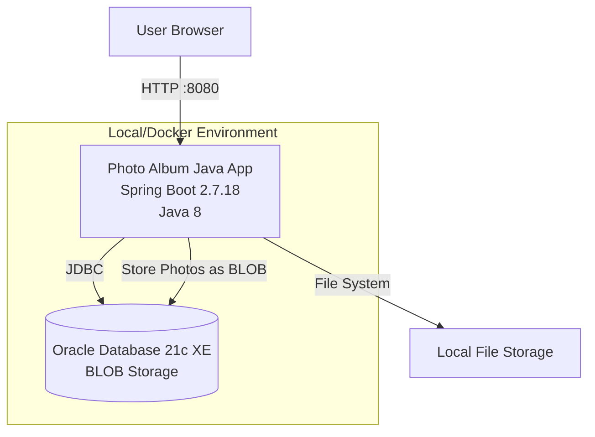
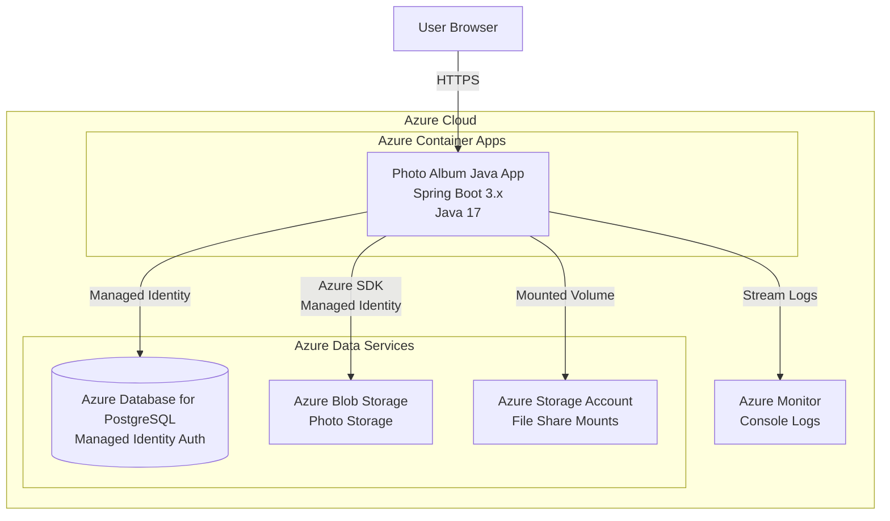

# Modernization Plan

**Branch**: `001-migrate-oracle-to-azure` | **Date**: 2025-12-24

---

## Modernization Goal

Migrate the Photo Album Java application from Oracle Database to Azure, enabling cloud-native deployment on Azure with PostgreSQL as the database backend.

## Scope

This modernization plan covers the following areas:

1. **Java Upgrade**
   - JDK (8 → 17) [Required for modern Azure services and Spring Boot 3.x]
   - Spring Boot (2.7.18 → 3.x) [To leverage latest features and Azure integrations]

2. **Migration To Azure**
   - Migrate database from Oracle DB to Azure Database for PostgreSQL [PostgreSQL is the preferred migration target for Oracle]
   - Migrate photo BLOB storage to Azure Blob Storage [For scalable cloud storage]
   - Migrate file-based logging to console logging [For Azure Monitor integration]
   - Migrate local file system usage to Azure Storage Account File Share mounts [For cloud-native file handling]

3. **Containerize**
   - Update Dockerfile for Java 17 and Spring Boot 3.x compatibility

4. **Deploy**
   - Generate deployment files for Azure Container Apps
   - Deploy the application to Azure

## Application Information

### Current Architecture

**Technology Stack:**
- **Framework**: Spring Boot 2.7.18
- **Java Version**: 8
- **Database**: Oracle Database 21c Express Edition
- **Build Tool**: Maven
- **Storage**: Database BLOBs for photos
- **Containerization**: Docker with multi-stage build

**Current Database Schema:**
- **PHOTOS Table** with BLOB storage for photo data
- UUID-based primary keys
- Metadata columns (file size, dimensions, mime type, upload timestamp)

## Target Architecture

**Target Technology Stack:**
- **Framework**: Spring Boot 3.x
- **Java Version**: 17
- **Database**: Azure Database for PostgreSQL with Managed Identity
- **Photo Storage**: Azure Blob Storage (migrated from database BLOBs)
- **File System**: Azure Storage Account File Share mounts
- **Logging**: Console logging with Azure Monitor integration
- **Hosting**: Azure Container Apps
- **Authentication**: Managed Identity for Azure services

## Task Breakdown

1) **Task name**: Upgrade Spring Boot to 3.x  
   - **Task Type**: Java Upgrade  
   - **Description**: Upgrade Spring Boot from 2.7.18 to 3.x. This includes upgrading JDK to 17, Spring Framework to 6.x, and migrating from JavaEE (javax.*) to Jakarta EE (jakarta.*). This upgrade provides improved security, performance, and compatibility with modern Azure services.
   - **Solution Id**: spring-boot-upgrade

2) **Task name**: Migrate from Oracle DB to Azure Database for PostgreSQL  
   - **Task Type**: Migration To Azure  
   - **Description**: Migrate database from Oracle Database to Azure Database for PostgreSQL. Update JDBC connections, Hibernate dialects, and SQL queries to be PostgreSQL-compatible. PostgreSQL is the preferred migration target for Oracle databases on Azure.
   - **Solution Id**: oracle-to-postgresql

3) **Task name**: Migrate photo storage to Azure Blob Storage  
   - **Task Type**: Migration To Azure  
   - **Description**: Migrate photo storage from database BLOBs to Azure Blob Storage. Update the PhotoService to use Azure SDK for Blob Storage operations. This provides better scalability and cost-effectiveness for large binary data storage.
   - **Solution Id**: mi-postgresql-azure-sdk-public-cloud

4) **Task name**: Migrate to Console Logging  
   - **Task Type**: Migration To Azure  
   - **Description**: Migrate from file-based logging to console logging to support cloud-native apps and integration with Azure Monitor. This enables centralized log collection and analysis in Azure.
   - **Solution Id**: log-to-console

5) **Task name**: Migrate to Azure Storage Account File Share mounts  
   - **Task Type**: Migration To Azure  
   - **Description**: Migrate from local file system to Azure Storage Account File Share mounts for scalable and secure file storage. This ensures persistent file storage in containerized cloud environments.
   - **Solution Id**: local-files-to-mounted-azure-storage

6) **Task name**: Update Dockerfile for Java 17 and Spring Boot 3.x  
   - **Task Type**: Containerize  
   - **Description**: Update the existing Dockerfile to use Java 17 runtime and ensure compatibility with Spring Boot 3.x. Update base images and build configurations accordingly.
   - **Solution Id**: containerization-copilot-agent

7) **Task name**: Deploy to Azure Container Apps  
   - **Task Type**: Deploy  
   - **Description**: Generate deployment files (Bicep/Terraform) for Azure Container Apps and deploy the modernized application to Azure. This includes provisioning all required Azure resources (Container Apps, PostgreSQL, Blob Storage, File Share) and configuring Managed Identity for secure authentication.
   - **Solution Id**: N/A (deployment task)
