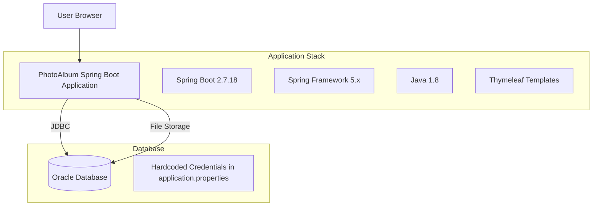
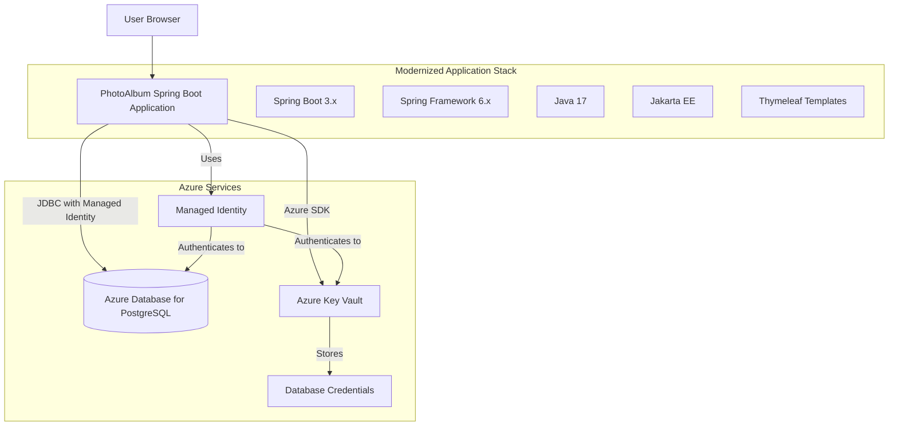

# Modernization Plan

**Branch**: `001-migrate-photoalbum-to-azure` | **Date**: 2025-12-19 | **Github Issue**: https://github.com/showpune/PhotoAlbum-Java/issues/10

---

## Modernization Goal

Migrate the PhotoAlbum Java application to Azure, upgrading the Java runtime and Spring Boot framework to modern supported versions, and migrating Oracle database to Azure PostgreSQL for deployment on Azure services (Azure Kubernetes Service, Azure App Service, or Azure Container Apps).

## Scope

Based on the assessment report from issue #10, this modernization plan covers:

1. **Java Upgrade**
   - JDK (1.8 → 17) [based on the assessment report - mandatory issue]
   - Spring Boot (2.7.18 → 3.x) [based on the assessment report - mandatory issue]
   - Spring Framework (will be upgraded as part of Spring Boot upgrade to 6.x)

2. **Migration to Azure**
   - Migrate database from Oracle to Azure Database for PostgreSQL [based on the assessment report - potential issue]
   - Migrate plaintext credentials to Azure Key Vault [based on the assessment report - potential issue: Password found in configuration file]

## References

- `https://github.com/showpune/PhotoAlbum-Java/issues/10` - Assessment report containing mandatory and potential issues

## Application Information

### Current Architecture

**Key Components:**
- **Framework**: Spring Boot 2.7.18 with Spring Framework 5.x
- **Runtime**: Java 1.8 (JDK 8)
- **Database**: Oracle Database (FREEPDB1) with JDBC connection
- **Template Engine**: Thymeleaf for server-side rendering
- **Data Access**: Spring Data JPA with Hibernate ORM
- **Build Tool**: Maven
- **Features**: Photo upload, storage in Oracle database as BLOBs, gallery display

## Clarification

1. **Target Azure Compute Service**: The assessment mentions three possible targets (AKS, App Service, Container Apps). Since the problem statement says "migrate app to azure" without specifying a particular compute service, we will focus on making the application Azure-ready through code modernization and will NOT include deployment task in this plan unless the user requests it.
   - Answer: [Pending user input]
   - Status: Not Blocking - Proceeding with application modernization only

## Target Architecture

**Target Components:**
- **Framework**: Spring Boot 3.x with Spring Framework 6.x
- **Runtime**: Java 17
- **Database**: Azure Database for PostgreSQL with managed identity authentication
- **Security**: Azure Key Vault for secrets management with managed identity
- **Data Access**: Spring Data JPA with Jakarta Persistence API
- **Template Engine**: Thymeleaf (compatible with Spring Boot 3.x)
- **Namespace Migration**: javax.* packages migrated to jakarta.* packages

## Task Breakdown

1. **Task name**: Upgrade Spring Boot to 3.x
   - **Task Type**: Java Upgrade
   - **Description**: Upgrade Spring Boot from 2.7.18 to 3.x which includes upgrading JDK to 17, Spring Framework to 6.x, and migrating from JavaEE (javax.*) to Jakarta EE (jakarta.*). This resolves the mandatory issues: Legacy Java version, Spring Boot Version is End of OSS Support, and Spring Framework Version End of OSS Support.
   - **Solution Id**: spring-boot-upgrade

2. **Task name**: Migrate from Oracle DB to Azure Database for PostgreSQL
   - **Task Type**: Migration To Azure
   - **Description**: Migrate the application from Oracle Database to Azure Database for PostgreSQL using Azure SDK and managed identity for secure, credential-free authentication. This resolves the potential issue of Oracle database dependency and hardcoded database credentials.
   - **Solution Id**: mi-postgresql-azure-sdk-public-cloud

3. **Task name**: Migrate plaintext credentials to Azure Key Vault
   - **Task Type**: Migration To Azure
   - **Description**: Migrate hardcoded passwords and connection strings from application.properties files to Azure Key Vault for secure secrets management. This resolves the potential issue of passwords found in configuration files.
   - **Solution Id**: plaintext-credential-to-azure-keyvault
