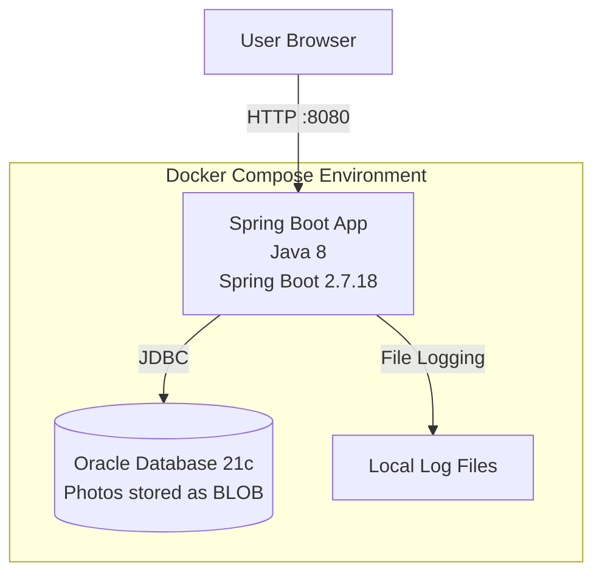
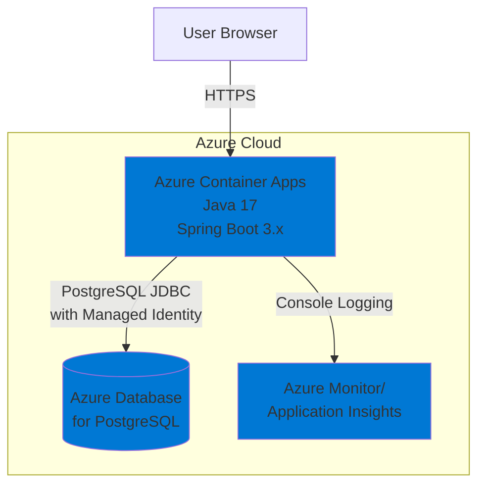

# Modernization Plan

**Branch**: `001-migrate-to-azure` | **Date**: 2025-12-23

---

## Modernization Goal

Migrate the Photo Album Java application from local Docker deployment with Oracle Database to Azure cloud platform with managed Azure services.

## Scope

This modernization plan covers the following scope based on the user request to migrate the project to Azure:

1. Java Upgrade
   - JDK (8 → 17) [required for modern Azure services and improved performance]
   - Spring Boot (2.7.18 → 3.x) [to leverage latest features and Azure integration]

2. Migration To Azure
   - Migrate database from Oracle DB to Azure Database for PostgreSQL [based on best practices for Azure migration]
   - Migrate logging from file-based to console logging [to support cloud-native monitoring with Azure Monitor]

3. Deploy
   - Generate deployment files and deploy the application to Azure Container Apps [for containerized deployment]

## Application Information

### Current Architecture

**Current Technology Stack:**
- **Framework**: Spring Boot 2.7.18 with Java 8
- **Database**: Oracle Database 21c Express Edition
  - Photos stored as BLOBs in database
  - JDBC connection with Oracle JDBC Driver (ojdbc8)
  - JPA/Hibernate for ORM with OracleDialect
- **Build Tool**: Maven
- **Templating**: Thymeleaf
- **Containerization**: Docker with multi-stage build
- **Logging**: DEBUG logging to console and files

**Database Schema:**
- PHOTOS table with BLOB storage for photo data
- UUID-based photo identification
- Metadata fields: filename, size, MIME type, dimensions, upload timestamp

## Clarification

No open issues at this time. The application has a straightforward architecture suitable for Azure migration.

## Target Architecture

**Target Technology Stack:**
- **Framework**: Spring Boot 3.x with Java 17
- **Database**: Azure Database for PostgreSQL
  - Flexible Server tier for production workloads
  - Managed Identity authentication for secure credential-free access
  - Photos continue to be stored as BLOBs (BYTEA in PostgreSQL)
- **Compute**: Azure Container Apps
  - Fully managed serverless container platform
  - Auto-scaling based on HTTP traffic
  - Built-in ingress with HTTPS
- **Monitoring**: Azure Monitor with Application Insights
  - Console-based logging for cloud-native observability
  - Application performance monitoring
  - Distributed tracing

## Task Breakdown

1) Task name: Upgrade Java to 17 and Spring Boot to 3.x  
   - Task Type: Java Upgrade  
   - Description: Upgrade the application from Java 8 to Java 17 and Spring Boot 2.7.18 to 3.x. This upgrade includes migrating from JavaEE (javax.*) to Jakarta EE (jakarta.*), upgrading Spring Framework to 6.x, and ensuring compatibility with modern Azure services.  
   - Solution Id: spring-boot-upgrade

2) Task name: Migrate from Oracle DB to Azure Database for PostgreSQL  
   - Task Type: Migration To Azure  
   - Description: Migrate the database from Oracle Database to Azure Database for PostgreSQL with Azure SDK and managed identity for secure, credential-free authentication. This includes updating JDBC connection strings, migrating the schema (BLOB to BYTEA), and updating Hibernate dialect.  
   - Solution Id: mi-postgresql-azure-sdk-public-cloud

3) Task name: Migrate to Console Logging  
   - Task Type: Migration To Azure  
   - Description: Migrate from file-based logging to console logging to support cloud-native applications and integration with Azure Monitor. This ensures logs are properly captured by Azure Container Apps and forwarded to Application Insights.  
   - Solution Id: log-to-console

4) Task name: Deploy to Azure Container Apps  
   - Task Type: Deploy  
   - Description: Generate Azure deployment files (Bicep/ARM templates or Azure Developer CLI configuration) and deploy the containerized application to Azure Container Apps with PostgreSQL backend, managed identity authentication, and Application Insights monitoring.
