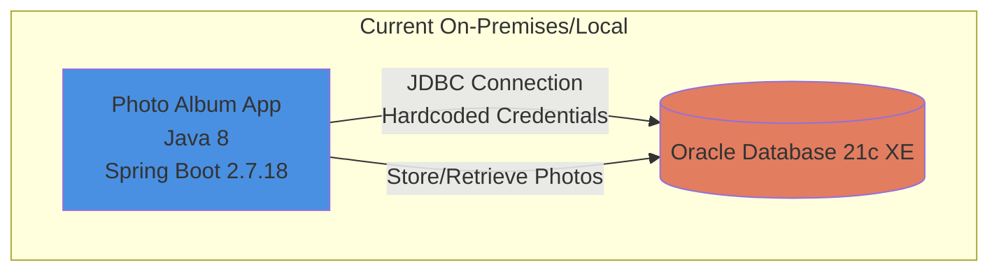
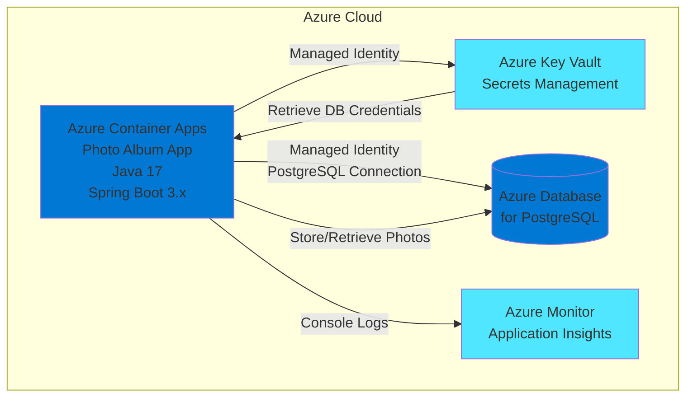

# Modernization Plan

**Branch**: `001-migrate-to-azure` | **Date**: 2025-12-23

---

## Modernization Goal

Migrate the Photo Album Java application to Azure Container Apps with managed Azure services, ensuring the application is cloud-native and follows Azure best practices.

## Scope

This modernization plan covers the following areas:

1. **Java Upgrade**
   - JDK (8 → 17) [Required for Spring Boot 3.x compatibility]
   - Spring Boot (2.7.18 → 3.x) [To leverage the latest features and security updates]

2. **Migration To Azure**
   - Migrate database from Oracle DB to Azure Database for PostgreSQL [Based on Azure migration best practices - PostgreSQL is the preferred target for Oracle migrations]
   - Migrate plaintext credentials to Azure Key Vault [Based on security best practices - removing hardcoded credentials from configuration]
   - Enable console logging for cloud-native architecture [To support integration with Azure Monitor and Application Insights]

3. **Containerize**
   - Generate Dockerfile and container configuration for Azure Container Apps deployment

4. **Deploy**
   - Generate deployment files (Bicep/Terraform) and deploy the application to Azure Container Apps

## Application Information

### Current Architecture

**Current Stack:**
- **Framework**: Spring Boot 2.7.18
- **Java Version**: 8
- **Database**: Oracle Database 21c Express Edition
- **ORM**: Spring Data JPA with Hibernate
- **Authentication**: Hardcoded credentials in application.properties
- **Storage**: BLOB storage in Oracle Database
- **Logging**: File-based and console logging (mixed)

## Clarification

No open issues requiring clarification. The migration path is clear:
- Oracle to PostgreSQL migration is a standard path with good tooling support
- Spring Boot 2.7 to 3.x requires JDK 17
- Application uses standard Spring Data JPA, which supports PostgreSQL
- Photo storage as BLOBs can be migrated to PostgreSQL (supports BYTEA)

## Target Architecture

**Target Stack:**
- **Compute**: Azure Container Apps
- **Framework**: Spring Boot 3.x
- **Java Version**: 17
- **Database**: Azure Database for PostgreSQL with Managed Identity
- **Secrets Management**: Azure Key Vault with Managed Identity
- **Logging**: Console logging integrated with Azure Monitor
- **Storage**: BYTEA (PostgreSQL equivalent of BLOB) for photo storage

## Task Breakdown

### 1. Upgrade Spring Boot to 3.x
- **Task Type**: Java Upgrade
- **Description**: Upgrade Spring Boot from 2.7.18 to 3.x. This task includes upgrading JDK to 17, Spring Framework to 6.x, and migrating from JavaEE (javax.*) to Jakarta EE (jakarta.*) packages. This is a comprehensive upgrade that ensures compatibility with modern Azure services and provides improved security, performance, and cloud-native features.
- **Solution Id**: spring-boot-upgrade

### 2. Migrate from Oracle DB to Azure Database for PostgreSQL
- **Task Type**: Migration To Azure
- **Description**: Migrate the database from Oracle Database 21c to Azure Database for PostgreSQL with Azure SDK and managed identity for secure, credential-free authentication. This includes migrating the PHOTOS table schema, converting BLOB columns to BYTEA, updating JDBC connection strings, and modifying the Hibernate dialect.
- **Solution Id**: mi-postgresql-azure-sdk-public-cloud

### 3. Migrate from Plaintext Credentials to Azure Key Vault
- **Task Type**: Migration To Azure
- **Description**: Remove hardcoded database credentials from application.properties and migrate them to Azure Key Vault for secure storage and retrieval. The application will use Spring Cloud Azure Key Vault integration to fetch secrets at runtime.
- **Solution Id**: plaintext-credential-to-azure-keyvault

### 4. Migrate to Console Logging
- **Task Type**: Migration To Azure
- **Description**: Migrate from file-based logging to console logging to support cloud-native architecture and integration with Azure Monitor and Application Insights. This ensures all application logs are properly captured and visible in Azure's logging infrastructure.
- **Solution Id**: log-to-console

### 5. Deploy to Azure Container Apps
- **Task Type**: Deploy
- **Description**: Generate necessary deployment files (Dockerfile, Bicep/Terraform templates) and deploy the Photo Album application to Azure Container Apps. This includes containerizing the application, provisioning Azure resources (Container Apps, PostgreSQL, Key Vault), and configuring managed identities for secure service-to-service communication.
- **Solution Id**: N/A (Deployment task)

---

## Notes

- The migration from Oracle to PostgreSQL requires careful attention to:
  - BLOB to BYTEA conversion for photo storage
  - Oracle-specific SQL functions that may need PostgreSQL equivalents
  - Hibernate dialect changes
- Managed Identity eliminates the need for credential management after initial setup
- Azure Container Apps provides auto-scaling and simplified container management
- All tasks should be executed in the specified order due to dependencies
