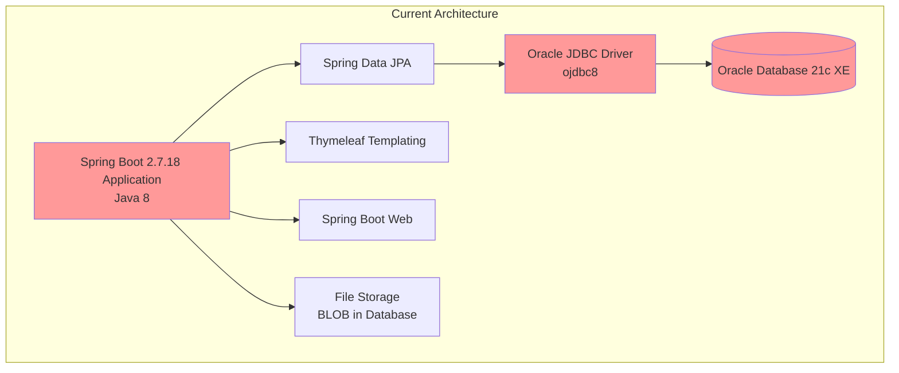
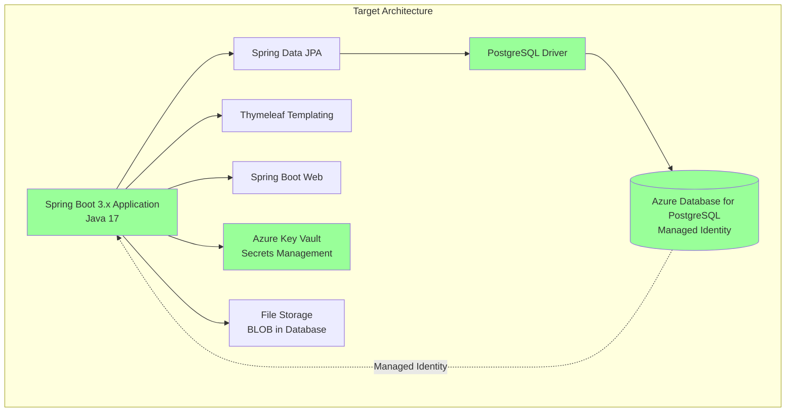

# Modernization Plan

**Branch**: `001-modernize-java-springboot-to-azure` | **Date**: 2025-12-02 | **Github Issue**: To be created

---

## Modernization Goal

Modernize the Photo Album Java application to prepare it for Azure deployment by upgrading the application framework (Java 8 to Java 17, Spring Boot 2.7.18 to 3.x) and migrating from Oracle Database to Azure Database for PostgreSQL with managed identity for secure, credential-free authentication.

## Scope

This modernization plan covers the following scope types:

### 1. Java Upgrade
   - **JDK (8 → 17)** - Based on assessment report (mandatory issue: Legacy Java version)
   - **Spring Boot (2.7.18 → 3.x)** - Based on assessment report (mandatory issue: Spring Boot Version is End of OSS Support)
   - **Spring Framework (End of OSS Support → 6.x)** - Included in Spring Boot upgrade (mandatory issue: Spring Framework Version End of OSS Support)
   - **Jakarta EE (javax.* → jakarta.*)** - Included in Spring Boot upgrade (migration to Jakarta namespace)

### 2. Migration to Azure
   - **Migrate from Oracle Database to Azure Database for PostgreSQL** - Based on assessment report (potential issue: Oracle database found)
   - **Migrate plaintext credentials to Azure Key Vault** - Based on assessment report (potential issue: Password found in configuration file)

## References

- `.github/appmod/appcat/result/summary.md` - Contains the assessment report with detailed findings
- `.github/appmod/MODERNIZATION_ISSUE_REPORT.md` - Contains the comprehensive modernization tracking report

## Application Information

### Current Architecture

**Current Stack:**
- **Framework**: Spring Boot 2.7.18 (End of OSS Support)
- **Java Version**: 1.8 (Legacy version)
- **Database**: Oracle Database 21c Express Edition
- **Database Driver**: Oracle JDBC Driver (ojdbc8)
- **ORM**: Spring Data JPA with Hibernate
- **Templating**: Thymeleaf
- **Build Tool**: Maven
- **Dependencies**:
  - Spring Boot Starter Web
  - Spring Boot Starter Data JPA
  - Spring Boot Starter Thymeleaf
  - Spring Boot Starter Validation
  - Oracle JDBC Driver (ojdbc8)
  - Commons IO 2.11.0

**Current Issues:**
- Java 8 is legacy and not recommended for cloud deployment
- Spring Boot 2.7.18 has reached End of OSS Support
- Spring Framework version is End of OSS Support
- Oracle Database requires migration to Azure-compatible database
- Plaintext passwords in configuration files (security risk)

## Clarification

No open issues requiring clarification at this time. The modernization path is clear based on the assessment results.

## Target Architecture

**Target Stack:**
- **Framework**: Spring Boot 3.x (Latest stable version)
- **Java Version**: 17 (LTS version, Azure recommended)
- **Database**: Azure Database for PostgreSQL (Managed service)
- **Authentication**: Managed Identity (Passwordless authentication)
- **Database Driver**: PostgreSQL JDBC Driver
- **ORM**: Spring Data JPA with Hibernate
- **Secrets Management**: Azure Key Vault (for secure credential storage)
- **Templating**: Thymeleaf
- **Build Tool**: Maven
- **Deployment Target**: Azure Container Apps / Azure App Service / Azure Kubernetes Service

**Improvements:**
- Modern Java version (17) with better performance and security
- Spring Boot 3.x with active support and latest features
- Azure-native database service with automatic backups, scaling, and high availability
- Passwordless authentication using Managed Identity
- Secure secrets management with Azure Key Vault
- Cloud-ready configuration

## Task Breakdown

### Task 1: Upgrade Spring Boot to 3.x
- **Task Type**: Java Upgrade
- **Description**: Upgrade Spring Boot from 2.7.18 to 3.x (latest stable version). This upgrade includes:
  - Upgrading JDK from 8 to 17 (minimum requirement for Spring Boot 3.x)
  - Upgrading Spring Framework to 6.x (included in Spring Boot 3.x)
  - Migrating from JavaEE (javax.*) to Jakarta EE (jakarta.*) namespace
  - Updating all Spring Boot dependencies to version 3.x
  - Resolving any API changes and deprecations
- **Solution Id**: spring-boot-upgrade

### Task 2: Migrate from Oracle Database to Azure Database for PostgreSQL
- **Task Type**: Migration to Azure
- **Description**: Migrate the application from Oracle Database 21c to Azure Database for PostgreSQL. This includes:
  - Replacing Oracle JDBC driver (ojdbc8) with PostgreSQL JDBC driver
  - Updating database connection configuration
  - Migrating database schema (tables, indexes, constraints)
  - Updating SQL queries for PostgreSQL compatibility
  - Testing data migration and application functionality
- **Solution Id**: oracle-to-postgresql

### Task 3: Migrate plaintext credentials to Azure Key Vault
- **Task Type**: Migration to Azure
- **Description**: Migrate hardcoded passwords and sensitive credentials from configuration files to Azure Key Vault. This includes:
  - Removing plaintext passwords from application.properties and docker-compose.yml
  - Integrating Azure Key Vault SDK for retrieving secrets
  - Configuring Spring Boot to use Azure Key Vault for externalized configuration
  - Implementing proper secret naming conventions
  - Setting up managed identity for secure access to Key Vault
- **Solution Id**: plaintext-credential-to-azure-keyvault

---

## Execution Notes

1. **Task Order**: Tasks must be executed in the order listed above. Java upgrade must be completed first before any Azure migration tasks.

2. **Testing**: After each task, build the application and run unit tests to ensure no regressions.

3. **Database Migration**: Task 2 (Oracle to PostgreSQL) may require schema adjustments and data migration scripts. The migration tool will handle JDBC driver changes and configuration updates, but manual verification is recommended.

4. **Security**: Task 3 (Key Vault integration) is critical for production deployment. Ensure managed identity is properly configured before deploying to Azure.

5. **Deployment Readiness**: After completing all tasks, the application will be ready for containerization and deployment to Azure services (Container Apps, App Service, or AKS).

6. **Rollback Plan**: Each task should be committed separately to allow for easy rollback if issues arise.

---

## Success Criteria

- ✅ Application successfully builds with Java 17 and Spring Boot 3.x
- ✅ All unit tests pass
- ✅ Database connectivity works with Azure Database for PostgreSQL
- ✅ No plaintext credentials in configuration files
- ✅ Managed identity authentication configured
- ✅ Application runs successfully in local development environment
- ✅ Ready for Azure deployment
